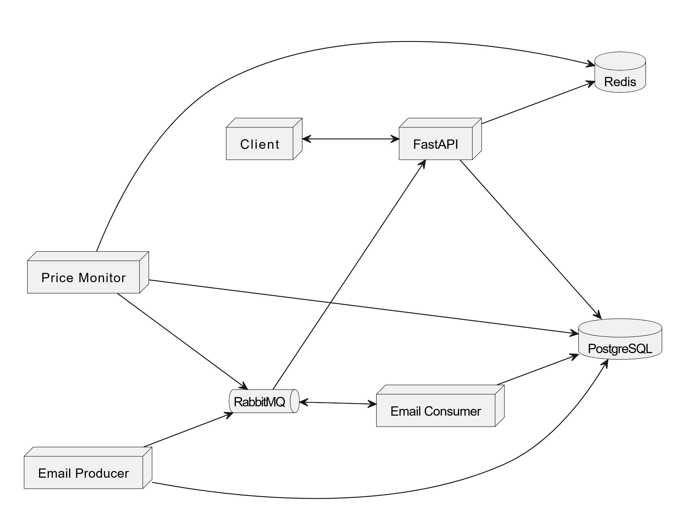

The system follows an asynchronous, event-driven microservices pattern. This decouples the user-facing API from intensive background processing tasks, ensuring high availability and responsiveness.



## Getting Started

### Prerequisites
1. **Docker**: Ensure [Docker Desktop](https://www.docker.com/products/docker-desktop/) is installed and running on your machine.
2. **Configuration**: You must configure your environment variables before starting.
    * Navigate to the `backend/` directory.
    * Copy the example environment file: `cp .env.example .env`
    * Open `.env` and provide the necessary credentials (DB URLs, SMTP settings, etc.).

### Running the System
To launch the system, run the following commands in the root directory:

```bash
# Start the system in detached mode
docker-compose up -d

# Stop and remove volumes (Warning: resets database data)
docker-compose down -v
```

### Updating a Single Container
If you make changes to a specific service (e.g., `backend`) and want to update only that container without restarting the entire stack, use:

```bash
# Rebuild and recreate only the specified service
docker-compose up -d --no-deps --build <service_name>
```
*Note: Replace `<service_name>` with the name of the service defined in your docker-compose.yml (e.g., `backend`, `email_consumer`).*

## Database Migrations
We use Alembic for database migrations. To apply changes to your database schema, run:

```bash
# Generate a new migration based on your current models
docker-compose exec backend alembic revision --autogenerate -m "initial_migration"

# Apply the migration to the database
docker-compose exec backend alembic upgrade head
```

### Note on Migration Reset
The command `Remove-Item -Path . ackend\migrations ersions\* -Filter "*.py" -Exclude "__init__.py" -Force` is used to **completely wipe your existing migration history**.

**You do not need this command under normal circumstances.** You should only use it if you are in the early development phase and decide to completely restructure your database models and need to restart your migration history from scratch. Using this in a production or stable development environment will cause synchronization issues between your code and your database schema.

## Documentation
For a detailed breakdown of the backend components, data flows, and technology stack, see [README_BACKEND.md](backend/README_BACKEND.md).